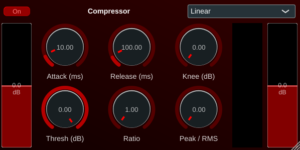
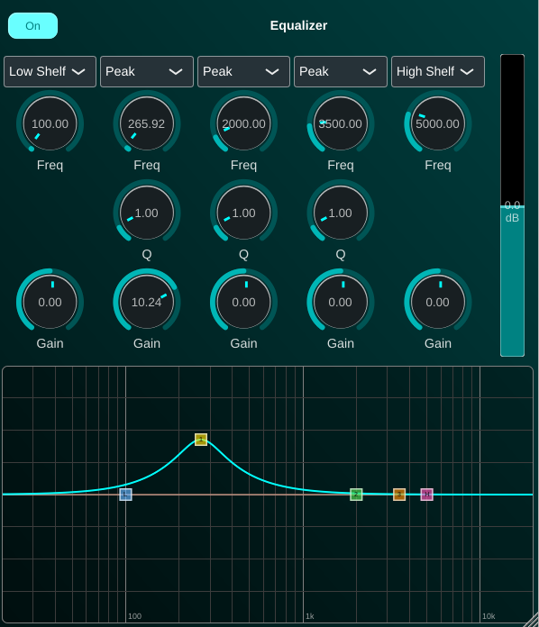
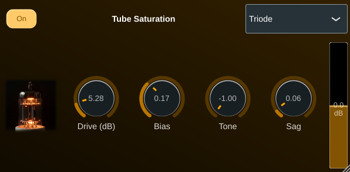
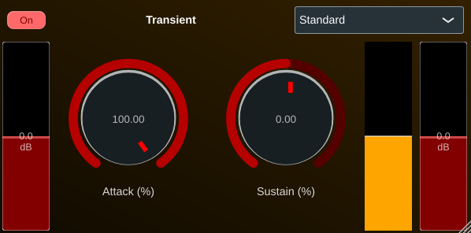
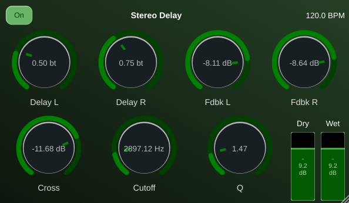
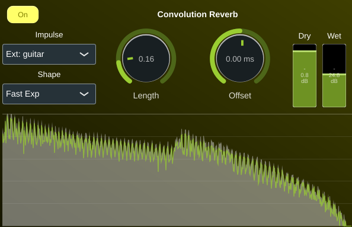
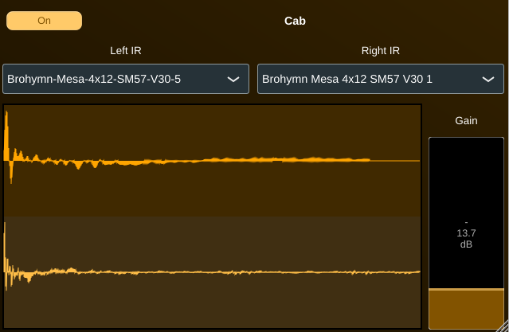
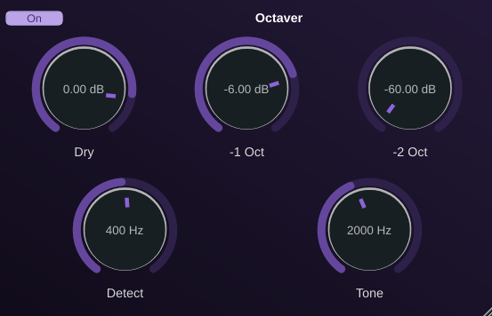

# FxmeFX

A small collection of JUCE audio-effect plugins by **FX-Mechanics**.

Each effect is a self-contained DSP class plus a matching GUI component, wrapped
in a minimal `AudioProcessor` / `AudioProcessorEditor` so they can be used both
as standalone plugins (the targets built here) and as building blocks inside
larger projects (the same classes are reused, for example, in the FxmeSampler
drum kits).

## Plugins

| Name             | Plugin code | Description                                    |
| ---------------- | ----------- | ---------------------------------------------- |
| FxmeCompressor   | `COMP`      | Compressor with peak/RMS detector, three release modes (Linear / Opto / Vintage), soft-knee and gain-reduction meter. |
| FxmeEqualizer    | `EQUL`      | 5-band parametric EQ. Each band switches between Lowpass, Highpass, Peak, Low Shelf and High Shelf, with an interactive frequency-response graph. |
| FxmeTube         | `TUBE`      | Valve / tube saturation with four models (Standard, Dynamic, Triode, Class-AB), bias, tone and power-supply sag. |
| FxmeTransient    | `TRNS`      | SPL-style transient designer using the Differential Envelope Technique - independent attack and sustain shaping. |
| FxmeStereoDelay  | `SDEL`      | Tempo-synced stereo delay with cross-feedback and a state-variable lowpass in the feedback path. |
| FxmeConvolReverb | `CREV`      | Convolution reverb (WDL engine) with six embedded impulse responses, length / shape / start-offset shaping, plus an "External…" slot for loading a user IR. |
| FxmeCab          | `CABN`      | Stereo cabinet/IR loader. Two independent mono-IR slots (one per output channel), 19 embedded cabinet IRs, output gain. |
| FxmeOct          | `OCTV`      | Boss OC-2-style monophonic octaver. Schmitt-trigger zero-crossing + ÷2 / ÷4 flip-flops, envelope-tracked square synthesis, dry / -1 oct / -2 oct mix, detection LPF and tone LPF. Zero latency, stable on bass. |
| FxmeLimiter      | `LIMT`      | Look-ahead brickwall limiter / maximizer. A short look-ahead lets the gain envelope duck before a peak arrives; Drive pushes the signal into the ceiling, and a final hard clamp guarantees the output never exceeds it. Drive / Ceiling / Release controls and a gain-reduction meter. |
| FxmeFreeze       | `FRZE`      | Spectral freeze (paulstretch-style FFT wash). Engaging it freezes the window of input *preceding* the switch, so the wash starts in the very next block. Mix and stereo Width. |
| FxmeChorus       | `CHOR`      | Stereo chorus. Two to four modulated delay taps per channel, spread evenly around one LFO cycle, no feedback. Rate / Depth / Delay / Voices / Width / Mix, free-running or tempo-synced. |
| FxmeFlanger      | `FLNG`      | Stereo flanger. One very short modulated delay per channel with bipolar feedback - positive sharpens the comb into the jet whoosh, negative inverts it for the hollow variant. Delay places the comb, Depth sets the sweep. Free-running or tempo-synced. |
| FxmePhaser       | `PHSR`      | Stereo phaser. 2 to 12 first-order allpass sections per channel swept by one LFO, with bipolar feedback. Freq is the sweep centre, Depth the excursion in octaves (up to 2.5 either way). Free-running or tempo-synced. |

All plugins build as **VST3**, **AU** (macOS) and a **Standalone** application,
and also as headless **Pure Data externals** — see the dedicated section below.

## Screenshots

| | |
| :---: | :---: |
| **FxmeCompressor** | **FxmeEqualizer** |
|  |  |
| **FxmeTube** | **FxmeTransient** |
|  |  |
| **FxmeStereoDelay** | **FxmeConvolReverb** |
|  |  |
| **FxmeCab** | **FxmeOct** |
|  |  |

## Installing

Download the zip for your platform from the
[latest release](https://github.com/odoare/FxmeFX/releases) and copy the
bundles into the folder your host scans.

### Linux

```bash
unzip FxmeFX-VST3-Linux-x86_64.zip -d ~/.vst3
```

### Windows

Copy the `.vst3` folders into `C:\Program Files\Common Files\VST3\`.

### macOS

Copy the `.vst3` bundles into `~/Library/Audio/Plug-Ins/VST3/` and the
`.component` bundles into `~/Library/Audio/Plug-Ins/Components/`.

These builds are **not notarised**, so macOS quarantines anything downloaded
from a browser and the DAW then skips the plugin without saying why. Clear the
quarantine flag after copying:

```bash
xattr -dr com.apple.quarantine ~/Library/Audio/Plug-Ins/VST3/Fxme*.vst3
xattr -dr com.apple.quarantine ~/Library/Audio/Plug-Ins/Components/Fxme*.component
```

Then rescan in the host (Logic revalidates AUs on launch; most other hosts have
a "rescan plugins" button). A host caches the module, so a reinstall over a
running DAW needs a restart to take effect.

## Pure Data externals

Each plugin also ships as a Pd signal external that reuses the exact same DSP
path as the VST/AU build — only the GUI is stripped and parameters are exposed
as Pd float inlets instead of host-automation parameters. The Pd build excludes
any "load IR from file" feature; both `fxmecab~` and `fxmeconvolreverb~` use
only their embedded built-in impulse responses.

Binaries are named `fxme<plugin>~.pd_linux` / `.pd_darwin` / `.dll`.

### Common conventions

- **Inlets 0 and 1** are always **audio L** and **audio R** (signal inlets).
- **Inlets 2..N+1** are **float** inlets, one per parameter, in the order
  listed below. Send a float, the value is forwarded to the underlying
  JUCE parameter on the next audio block.
- **Outlets 0 and 1** are **audio L** and **audio R**.
- Boolean parameters use **0 = off, 1 = on**. Choice parameters use the
  **zero-based index** of the option name.
- Each plugin has a top-level `On` switch that bypasses processing when 0;
  most default to off so you have to enable them explicitly.

### `fxmecompressor~`

| Inlet | Parameter | Range | Default |
|------:|-----------|-------|--------:|
| 2 | On                | 0 / 1                                     | 0    |
| 3 | Pre Gain (dB)     | -24 … 24                                  | 0    |
| 4 | Attack (ms)       | 0.1 … 100                                 | 10   |
| 5 | Release (ms)      | 10 … 1000                                 | 100  |
| 6 | Threshold (dB)    | -60 … 0                                   | 0    |
| 7 | Ratio             | 1 … 20                                    | 1    |
| 8 | Knee (dB)         | 0 … 24                                    | 0    |
| 9 | Release Mode      | 0 = Linear, 1 = Opto, 2 = Vintage         | 0    |
| 10 | Peak / RMS mix   | 0 (pure peak) … 1 (pure RMS)              | 0    |
| 11 | Make-up Gain (dB)| -24 … 24                                  | 0    |

### `fxmeequalizer~`

Two global parameters, then five bands. Each band has Type / Freq / Q / Gain
in that order. Band 1 defaults to Low Shelf, bands 2–4 to Peak, band 5 to
High Shelf, but every band can be reassigned to any of the five filter types.

| Inlet | Parameter | Range | Default |
|------:|-----------|-------|--------:|
| 2  | On                  | 0 / 1                                            | 0    |
| 3  | Post Gain (dB)      | -24 … 24                                         | 0    |
| 4  | Band 1 (LS) Type    | 0 = LP, 1 = HP, 2 = Peak, 3 = LowShelf, 4 = HighShelf | 3 |
| 5  | Band 1 (LS) Freq    | 20 … 20000                                       | 100  |
| 6  | Band 1 (LS) Q       | 0.1 … 10                                         | 1    |
| 7  | Band 1 (LS) Gain    | -24 … 24                                         | 0    |
| 8  | Band 2 (B1) Type    | 0 … 4                                            | 2    |
| 9  | Band 2 (B1) Freq    | 20 … 20000                                       | 500  |
| 10 | Band 2 (B1) Q       | 0.1 … 10                                         | 1    |
| 11 | Band 2 (B1) Gain    | -24 … 24                                         | 0    |
| 12 | Band 3 (B2) Type    | 0 … 4                                            | 2    |
| 13 | Band 3 (B2) Freq    | 20 … 20000                                       | 2000 |
| 14 | Band 3 (B2) Q       | 0.1 … 10                                         | 1    |
| 15 | Band 3 (B2) Gain    | -24 … 24                                         | 0    |
| 16 | Band 4 (B3) Type    | 0 … 4                                            | 2    |
| 17 | Band 4 (B3) Freq    | 20 … 20000                                       | 3500 |
| 18 | Band 4 (B3) Q       | 0.1 … 10                                         | 1    |
| 19 | Band 4 (B3) Gain    | -24 … 24                                         | 0    |
| 20 | Band 5 (HS) Type    | 0 … 4                                            | 4    |
| 21 | Band 5 (HS) Freq    | 20 … 20000                                       | 5000 |
| 22 | Band 5 (HS) Q       | 0.1 … 10                                         | 1    |
| 23 | Band 5 (HS) Gain    | -24 … 24                                         | 0    |

### `fxmetube~`

| Inlet | Parameter | Range | Default |
|------:|-----------|-------|--------:|
| 2 | On         | 0 / 1                                                       | 0   |
| 3 | Drive (dB) | 0 … 40                                                      | 0   |
| 4 | Bias       | 0 … 0.5                                                     | 0   |
| 5 | Tone       | -1 … 1                                                      | 0   |
| 6 | Sag        | 0 … 1                                                       | 0.5 |
| 7 | Output (dB)| -20 … 20                                                    | 0   |
| 8 | Model      | 0 = Standard, 1 = Dynamic, 2 = Triode, 3 = Class AB         | 0   |

### `fxmetransient~`

Attack/Sustain are signed amounts in percent (negative = attenuate, positive
= boost).

| Inlet | Parameter | Range | Default |
|------:|-----------|-------|--------:|
| 2 | On             | 0 / 1                                       | 0   |
| 3 | Pre Gain (dB)  | -24 … 24                                    | 0   |
| 4 | Attack (%)     | -100 … 100                                  | 0   |
| 5 | Sustain (%)    | -100 … 100                                  | 0   |
| 6 | Output Gain (dB)| -24 … 24                                   | 0   |
| 7 | Character      | 0 = Soft, 1 = Standard, 2 = Hard            | 1   |

### `fxmestereodelay~`

| Inlet | Parameter | Range | Default |
|------:|-----------|-------|--------:|
| 2  | On                 | 0 / 1                              | 1      |
| 3  | Delay L (s)        | 0 … 2                              | 0.5    |
| 4  | Delay R (s)        | 0 … 2                              | 0.75   |
| 5  | Feedback L (dB)    | -60 … 6                            | -6     |
| 6  | Feedback R (dB)    | -60 … 6                            | -6     |
| 7  | Cross Feedback (dB)| -60 … 6                            | -60    |
| 8  | Filter Cutoff (Hz) | 20 … 20000                         | 20000  |
| 9  | Filter Q           | 0.1 … 10                           | 0.707  |
| 10 | Dry Gain (dB)      | -60 … 6                            | 0      |
| 11 | Wet Gain (dB)      | -60 … 6                            | -6     |

### `fxmeconvolreverb~`

Six built-in impulse responses: 1 = Council Chamber, 2 = Forest short,
3 = Forest long, 4 = Rectangular room small, 5 = Rectangular room medium,
6 = Rectangular room large. The "External IR file" slot present in the VST
is **not** exposed in the Pd build.

| Inlet | Parameter | Range | Default |
|------:|-----------|-------|--------:|
| 2 | On                   | 0 / 1                                       | 1    |
| 3 | IR (built-in index)  | 1 … 6                                       | 1    |
| 4 | Length               | 0 … 1                                       | 1    |
| 5 | Shape                | 0 = Fast Exp, 1 = Linear, 2 = Slow Log      | 0    |
| 6 | Start Offset (ms)    | -100 … 100                                  | 0    |
| 7 | Dry Gain (dB)        | -60 … 6                                     | -60  |
| 8 | Wet Gain (dB)        | -60 … 6                                     | 0    |

### `fxmecab~`

Each output channel is convolved with an independently selectable mono
impulse response. The 19 built-in cabinet IRs are indexed 1 … 19 in the
order they appear in `Source/Cab/CMakeLists.txt`.

| Inlet | Parameter | Range | Default |
|------:|-----------|-------|--------:|
| 2 | On             | 0 / 1                                          | 1   |
| 3 | IR L (index)   | 1 … 19                                         | 1   |
| 4 | IR R (index)   | 1 … 19                                         | 2   |
| 5 | Output Gain (dB)| -24 … 24                                      | 0   |

### `fxmeoct~`

Bass-friendly OC-2-style octaver. Tune **Detect** just above the lowest
fundamental you expect to track (≈80–120 Hz on a 5-string low B,
≈200–300 Hz on guitar low E).

| Inlet | Parameter | Range | Default |
|------:|-----------|-------|--------:|
| 2 | On                  | 0 / 1                              | 1     |
| 3 | Dry (dB)            | -60 … 12                           | 0     |
| 4 | -1 Octave (dB)      | -60 … 12                           | -6    |
| 5 | -2 Octaves (dB)     | -60 … 12                           | -60   |
| 6 | Detect cutoff (Hz)  | 60 … 1500   (skewed, ~log scale)   | 400   |
| 7 | Tone cutoff (Hz)    | 300 … 10000 (skewed, ~log scale)   | 2000  |

### `fxmelimiter~`

Look-ahead brickwall limiter / maximizer. **Drive** pushes the signal into the
ceiling (the maximizer behaviour); **Ceiling** is the absolute output limit; a
fixed ~2 ms look-ahead anticipates peaks and a final hard clamp guarantees the
ceiling is never exceeded.

| Inlet | Parameter | Range | Default |
|------:|-----------|-------|--------:|
| 2 | On            | 0 / 1                       | 0    |
| 3 | Drive (dB)    | 0 … 24                      | 0    |
| 4 | Ceiling (dB)  | -24 … 0                     | -0.3 |
| 5 | Release (ms)  | 1 … 500   (skewed)          | 50   |

### `fxmefreeze~`

| Inlet | Parameter | Range | Default |
|------:|-----------|-------|--------:|
| 2 | On        | 0 / 1     | 0   |
| 3 | Mix (%)   | 0 … 100   | 50  |
| 4 | Width (%) | 0 … 100   | 100 |

### The modulation trio: `fxmechorus~`, `fxmeflanger~`, `fxmephaser~`

All three share the same LFO controls. **Shape** is
`0 = Sine, 1 = Tri, 2 = Square, 3 = Saw Up, 4 = Saw Dn`, and **Div** is the
zero-based index into

```
0..8   8/1  4/1  2/1  1/1  1/2  1/4  1/8  1/16  1/32
9..12  1/2T 1/4T 1/8T 1/16T
13..16 1/2. 1/4. 1/8. 1/16.
```

**Width** is the phase offset between the two channels' modulation (0 % =
both sides sweep together, i.e. mono). Feedback is signed: negative values
invert the comb.

Note that a Pd external has no host transport, so **Sync resolves against a
fixed 120 BPM** — in Pd, drive the rate in Hz and leave Sync at 0.

#### `fxmechorus~`

| Inlet | Parameter | Range | Default |
|------:|-----------|-------|--------:|
| 2  | On              | 0 / 1                    | 1    |
| 3  | Rate (Hz)       | 0.01 … 10  (skewed)      | 0.6  |
| 4  | Sync            | 0 / 1                    | 0    |
| 5  | Div             | 0 … 16 (see above)       | 3    |
| 6  | Shape           | 0 … 4  (see above)       | 0    |
| 7  | Depth (%)       | 0 … 100                  | 40   |
| 8  | Delay (ms)      | 1 … 40     (skewed)      | 12   |
| 9  | Voices          | 2 … 4                    | 2    |
| 10 | Width (%)       | 0 … 100                  | 100  |
| 11 | Mix (%)         | 0 … 100                  | 50   |
| 12 | Output (dB)     | -24 … 24                 | 0    |

#### `fxmeflanger~`

| Inlet | Parameter | Range | Default |
|------:|-----------|-------|--------:|
| 2  | On              | 0 / 1                    | 1    |
| 3  | Rate (Hz)       | 0.01 … 10  (skewed)      | 0.25 |
| 4  | Sync            | 0 / 1                    | 0    |
| 5  | Div             | 0 … 16 (see above)       | 3    |
| 6  | Shape           | 0 … 4  (see above)       | 0    |
| 7  | Depth (%)       | 0 … 100                  | 70   |
| 8  | Delay (ms)      | 0.1 … 10   (skewed)      | 1    |
| 9  | Feedback (%)    | -95 … 95                 | 50   |
| 10 | Width (%)       | 0 … 100                  | 100  |
| 11 | Mix (%)         | 0 … 100                  | 50   |
| 12 | Output (dB)     | -24 … 24                 | 0    |

#### `fxmephaser~`

| Inlet | Parameter | Range | Default |
|------:|-----------|-------|--------:|
| 2  | On              | 0 / 1                              | 1    |
| 3  | Rate (Hz)       | 0.01 … 10  (skewed)                | 0.3  |
| 4  | Sync            | 0 / 1                              | 0    |
| 5  | Div             | 0 … 16 (see above)                 | 3    |
| 6  | Shape           | 0 … 4  (see above)                 | 0    |
| 7  | Stages          | 0 = 2, 1 = 4, 2 = 6, … 5 = 12      | 1    |
| 8  | Depth (%)       | 0 … 100  (100 % = ±2.5 octaves)    | 70   |
| 9  | Freq (Hz)       | 60 … 4000  (skewed)                | 500  |
| 10 | Feedback (%)    | -95 … 95                           | 50   |
| 11 | Width (%)       | 0 … 100                            | 100  |
| 12 | Mix (%)         | 0 … 100                            | 50   |
| 13 | Output (dB)     | -24 … 24                           | 0    |

## Repository layout

```
FxmeFX/
├── CMakeLists.txt              # root: builds every plugin
├── Source/
│   ├── Compressor/             # Compressor.{h,cpp} + CompressorComponent.{h,cpp}
│   │                           # + PluginProcessor / PluginEditor / CMakeLists.txt
│   ├── Equalizer/
│   ├── Tube/
│   │   └── img/                # tube.png / tube_bw.png (embedded as binary data)
│   ├── Transient/
│   ├── StereoDelay/
│   ├── ConvolReverb/
│   │   └── ir/                 # built-in impulse responses (embedded as binary data)
│   ├── Cab/
│   │   └── IR/                 # built-in cabinet impulse responses (embedded as binary data)
│   ├── Oct/                    # Boss-style frequency-division octaver
│   ├── Limiter/                # look-ahead brickwall limiter / maximizer
│   ├── Freeze/                 # spectral freeze
│   ├── Chorus/                 # stereo chorus (tempo-syncable LFO)
│   ├── Flanger/                # stereo flanger (tempo-syncable LFO)
│   ├── Phaser/                 # stereo phaser  (tempo-syncable LFO)
│   └── VuMeter/                # re-export shims for fxme::VuMeter / fxme::VuMeterComponent
├── lib/
│   └── FxmeTools/              # submodule: shared GUI/DSP + nested WDL submodule
└── .github/workflows/          # CI: per-OS builds + tag-driven release
```

## Prerequisites

JUCE is expected as a **sibling of this repository** (CI mirrors the same
layout); all other shared code (GUI controls, look-and-feel, DSP, and the WDL
convolution engine) ships in the **FxmeTools** submodule under `lib/FxmeTools`:

```
<workspace>/
├── FxmeFX/                                  # this repo (lib/FxmeTools submodule inside)
├── JUCE/                                    # https://github.com/juce-framework/JUCE
└── ...
```

Quick setup:

```bash
git clone https://github.com/juce-framework/JUCE.git ../JUCE

# Pulls in FxmeTools and its nested WDL submodule.
git submodule update --init --recursive
```

### Linux system dependencies

```bash
sudo apt install -y \
    libasound2-dev libx11-dev libxrandr-dev libxinerama-dev \
    libxcursor-dev libfreetype-dev libfontconfig1-dev libgl1-mesa-dev
```

## Building

### All plugins from the repository root

```bash
cmake -S . -B build -DCMAKE_BUILD_TYPE=Release
cmake --build build --parallel
```

Built artefacts land in `build/Source/<Plugin>/Fxme<Plugin>_artefacts/Release/`.

### A single plugin from the root

```bash
cmake -S . -B build -DCMAKE_BUILD_TYPE=Release -DPLUGIN=Compressor
cmake --build build --parallel
```

`PLUGIN` accepts: `Compressor`, `Equalizer`, `Tube`, `Transient`,
`StereoDelay`, `ConvolReverb`, `Cab`, `Oct`, `Limiter`, `Freeze`, `Chorus`,
`Flanger`, `Phaser`.

### A single plugin standalone

Each plugin's `CMakeLists.txt` also works on its own — useful when iterating
on one effect:

```bash
cmake -S Source/Compressor -B Source/Compressor/build -DCMAKE_BUILD_TYPE=Release
cmake --build Source/Compressor/build --parallel
```

### Pure Data externals on Windows

On Linux and macOS the Pd externals link with undefined symbols and Pd
resolves the `m_pd.h` ABI at load time. MSVC won't do that — its linker
needs an import library. Point CMake at `bin/pd.lib` from a Pd-vanilla
Windows install:

```pwsh
cmake -B build -S . -G "Visual Studio 17 2022" `
    "-DFXME_PD_LIB=C:/Program Files/Pd/bin/pd.lib"
cmake --build build --config Release --target FxmeCompressor_pd
```

CI fetches Pd-vanilla automatically; only local Windows builds need this.

## Releases

Pushing a version tag like `v0.1.0` triggers
[`release.yml`](.github/workflows/release.yml), which builds every plugin on
Linux (x86_64), macOS (universal arm64+x86_64) and Windows (x86_64),
zips them per platform, and publishes a GitHub Release with the artefacts
attached.

```bash
git tag v0.1.0
git push origin v0.1.0
```

## License

FxmeFX is released under the **GNU Lesser General Public License, version 3**
(LGPL-3.0) - see [LICENSE](LICENSE).

Vendored / external code keeps its own terms:

- [FxmeTools](https://github.com/odoare/FxmeTools) - LGPL-3.0-or-later; bundles
  [WDL](lib/FxmeTools/WDL/) (zlib-style license) as a nested submodule.
- [JUCE](https://juce.com/) - used per its end-user license; the GPL build is
  the one exercised here.
